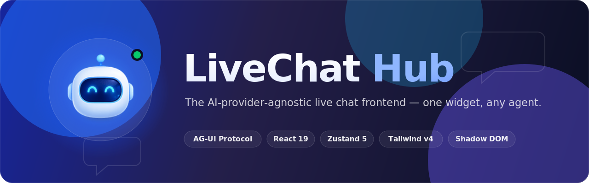

<div align="center">



<p>
  <a href="https://github.com/JamesHust/livechat-hub/actions/workflows/ci.yml"></a>
  
  
  
  
  
  
</p>

<p>
  <a href="#getting-started"><b>Getting Started</b></a> ·
  <a href="#architecture-in-one-diagram"><b>Architecture</b></a> ·
  <a href="#embedding-production"><b>Embedding</b></a> ·
  <a href="docs/BACKEND.md"><b>Backend Contract</b></a>
</p>

</div>

---

A production-ready, **AI-provider-agnostic** live chat frontend platform. The UI
talks to the backend only through an **AG-UI compatible event protocol** and a
**Vercel-AI-SDK-inspired message model**, so any agent framework can power it
without UI rewrites.

## Monorepo layout

```
apps/
  widget-ui    Standalone widget harness (dev/QA), builds an embeddable bundle
  demo-site    Partner-website integration simulator (+ mock AG-UI SSE backend)
  extension    Chrome Extension (MV3) reusing the shared widget UI

packages/
  shared       Types, enums, constants, i18n, theme contracts (no runtime deps)
  transport    AG-UI event protocol: definitions, parsing, validation, SSE adapter
  core         Headless Zustand stores + streaming orchestration (no React)
  renderers    React renderers per message part (override-able)
  ui           Reusable React components (ChatWindow, Composer, …)
  themes       Theme tokens, light/dark, CSS-variable contract + base stylesheet
  sdk          Public SDK: Shadow DOM bootstrap, mounting, public API

tooling/
  eslint-config   Shared flat ESLint config (base + React presets)
  tsconfig        Shared TypeScript configs
```

## Architecture in one diagram

```
Partner site → SDK → Shadow DOM → ui (React) → core store → transport → SSE → Go backend → AI agent
```

The frontend never imports any AI provider SDK. Data flows in as AG-UI events;
the core store folds them into the canonical `UIMessage[]`; renderers display
each `MessagePart`. See [`docs/BACKEND.md`](docs/BACKEND.md) for the contract the
separate `livechat-api` (Go) repo must implement.

## Getting started

### Prerequisites

- **Node.js** ≥ 18 and **pnpm** (`npm install -g pnpm` if you don't have it).

```bash
node -v
pnpm -v
```

### Run the demo (step by step)

1. **Open a terminal at the repo root.**

   ```bash
   cd "<path>/livechat-hub"
   ```

2. **Install dependencies** (first time only).

   ```bash
   pnpm install
   ```

3. **Start the partner-site demo** — the main "run it" target, bundled with a
   mock AG-UI SSE backend so no Go backend is required.

   ```bash
   pnpm --filter @livechat-hub/demo-site dev
   ```

4. **Open the URL the terminal prints** (e.g. `http://localhost:5173/`).

   > If port `5173` is already in use, Vite automatically falls back to the next
   > free port (e.g. `5174`) — always open the exact URL shown in the terminal.

5. **Try it out:** open the chat bubble and ask about the **weather** to see a
   full streamed tool-call lifecycle (`RUN_STARTED` → `TOOL_CALL_*` →
   `TEXT_MESSAGE_CONTENT` deltas → `RUN_FINISHED`) rendered end-to-end.

6. **Stop the server** with `Ctrl + C` in the terminal.

### Other run targets

```bash
# Standalone widget harness:
pnpm --filter @livechat-hub/widget-ui dev      # http://localhost:5174

# Everything:
pnpm dev
```

## Quality

```bash
pnpm typecheck   # tsc --noEmit across the graph
pnpm lint        # ESLint (flat config)
pnpm test        # Vitest unit/component tests
pnpm build       # Turborepo build (SDK + apps bundles)
```

## Embedding (production)

```html
<script src="livechat-sdk.js"></script>
<script>
  LiveChatHub.init({
    apiUrl: 'https://api.example.com',
    tenantId: 'tenant_123',
    theme: 'default',
  });
</script>
```

Build the bundle with `pnpm --filter @livechat-hub/sdk build`
(emits `packages/sdk/dist/livechat-sdk.js`).

## Design notes

- **Internal packages are consumed as TypeScript source** — apps bundle them
  directly via Vite, so there is no per-package build step (faster, simpler).
  Only the SDK and apps emit bundles.
- **Renderer overrides**: pass `renderers={{ image: MyImage }}` to `ChatProvider`
  or `renderers` to `LiveChatHub.init` to replace any part renderer.
- **White-label**: every visual is a `--lch-*` CSS variable; `themeOverrides`
  patches them at runtime without a rebuild.
